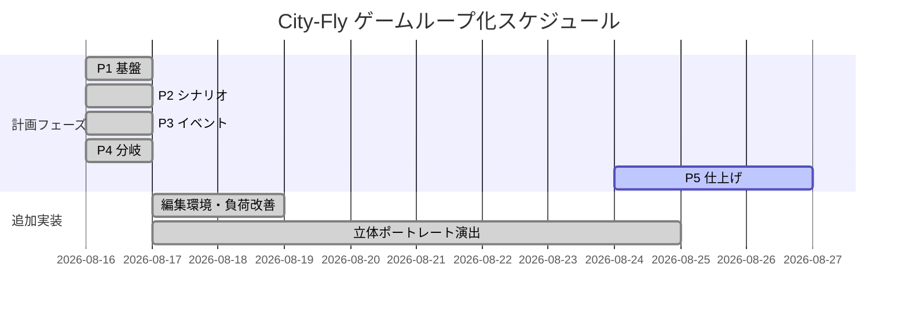

# 📊 PROJECT STATUS — 3D_GamingSystem / City-Fly ゲームループ化

**更新日時**: 2026-08-24
**ブランチ**: `feat/plateau-fly-city`
**現在のフェーズ**: P5 仕上げ（バランス・音・タイトル演出・通し確認）
**全体進捗**: 約 85%

> **注意**: `.claude/tasks.json` は旧プロジェクト（Phaser 3 RPG / 最終更新 2026-02-23）の内容のため、本書には反映していない。
> City-Fly の正式計画は `docs/cityfly-game-plan.md`（P1〜P5 のフェーズ定義と決定事項）。

---

## 📈 進捗状況

- ✅ 完了済み: 9 件（計画フェーズ P1〜P4 ＋ 演出・編集環境の追加実装 5 件）
- 🚧 進行中: 0 件
- ⏳ 未着手: 6 件（P5 内訳 4 件 ＋ 別キュー 2 件）

### 完了済みタスク

| タスク | 完了日 | 備考 |
|---|---|---|
| P1 基盤（状態機械・タイトル・GameParams・湧きゲート・GAME OVER） | 2026-08-16 | e2e 済（`.tmp/_p1_test.cjs`） |
| P2 シナリオ（2D紙芝居 `lib/scenario2d.js`・OP/ED story.json 化） | 2026-08-16 | e2e 済 |
| P3 イベント（events.json ランタイム・ゲーム内会話・敵投入ゲート） | 2026-08-16 | e2e 済 |
| P4 分岐（cityfly.flow.json・Badルート・Good/Bad ED・タイトル帰還） | 2026-08-16 | e2e 済（good/bad 両ルート） |
| Talk Editor 新設＋story-editor 2D再生 | 2026-08-17 | `talk-editor/`、talks.json 編集 |
| 負荷改善（スパイダー真因解消・ライト整理ほか） | 2026-08-17 | spawn 350→33ms |
| 立体ポートレート＋リップシンク | 2026-08-17 | 追加コスト実測ゼロ |
| 会話キャスト4人化＋OP/ED 全画面3Dステージ | 2026-08-24 | 博士/市長/幹部/エリクシラ |
| ED表示バグ修正＋会話相手の .npc.json（マント付き）対応 | 2026-08-24 | commit 59394ec |

### 残タスク（優先度順）

1. **P5: バランス調整** — 損耗ポイント仮値（jet=3/walker=20/spider=35）・Badルートしきい値（手配度★5）・敵量の実プレイ調整（計画書 §8）
2. **P5: Good ED 脚本差し替え** — 現在は仮テキスト（計画書 §6「後日追補」）
3. **P5: 通し確認** — タイトル→OP→本編→Good/Bad ED→タイトルの一周（dist ビルド含む）
4. **P5: 音・タイトル演出の仕上げ**
5. （キュー）vamp-dungeon ゾンビ（doctor.vrm＋zombie 系 VRMA・ラグドール撃倒）
6. （キュー）City-Fly プレイアブル VRM 入れ替えエディタ（npc.json 方式）

---

## 📅 Gantt Chart

---

## 📐 メトリクス

- **e2e テスト**: P1〜P4 全フェーズで Playwright 検証済み（pageerror 0）
- **フレーム時間（実測）**: 非会話 16.59ms / 会話中 18.09ms / OP 全画面3D 17.56ms
- **敵スポーンストール**: 350ms → 33ms（マテリアルキャッシュ＋事前ウォーム）
- **直近コミット**: 2026-08-14〜08-24 で 20 件（ゲームループ一周＋演出強化）

## ⚠️ リスク・ブロッカー

- `.claude/tasks.json` が旧プロジェクトのまま → 進捗管理の前提データとして機能していない（City-Fly 用に更新するか要判断）
- 未コミット: `public/timeline/Joy_reborn_groggy.timeline.json`（追跡外・コミット漏れの可能性）
- 顔グラ/2D背景素材はユーザー用意待ち（実 VRM ポートレート＋3D 背景板で代替済みのため優先度低）
- dist ビルド時の依存同梱（talks.json の vrm/npc 自動同梱・パス書き換え順序）に注意
